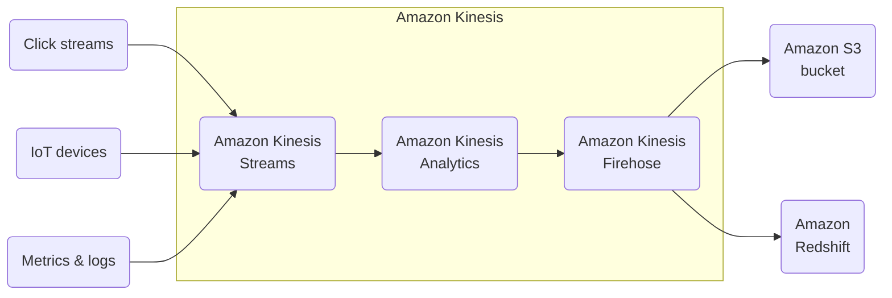
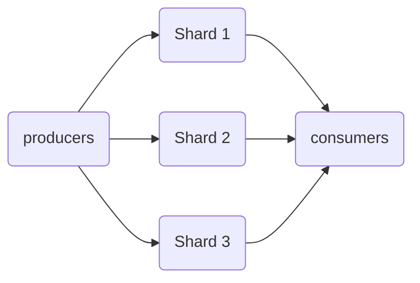
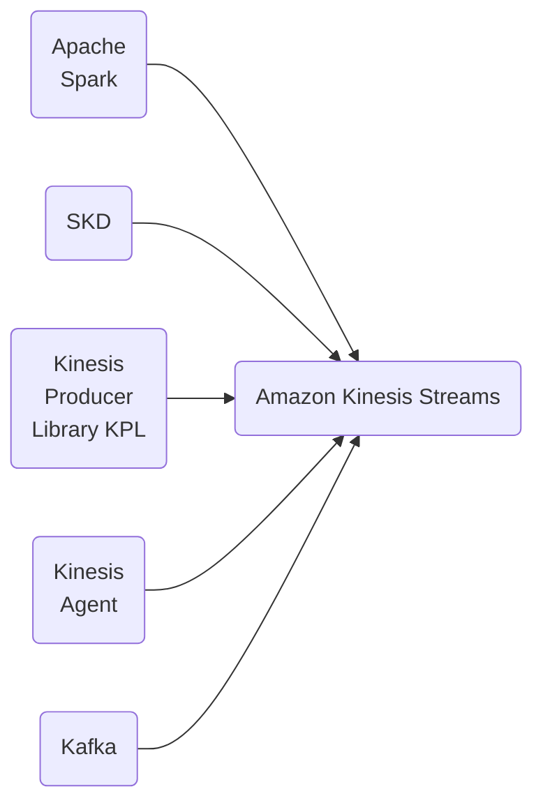

# Amazon Kinesis

## AWS Kinesis Overview

* Kinesis is a managed alternative to Apache Kafka.
* Great for applicaiton logs, metrics, Iot, clickstreams.
* Great for 'real-time' big data.
* Great for streaming processing frameworks (Spark, NiFi, etc)
* Data is automatically replicated synchronously to 3 AZ.
* Kinesis Streams: Low latency streaming ingest at scale
* Kinasys Analytics: Perform real-time analytics on streams using SQL.

### Kinesis

## Kinesis Streams Overview

* Streams are didvided into ordered Shard / Partitions

* Data retention is 24 hours by defaults. Can go up to 7 days.
* Ability ti reprocess / replay data.
* Multiple applications can consume the same stream.
* Real-Time processing with scale of throughput.
* Once data is inserted in Kinesis, it cannot be deleted (immutability).

## Kinesis Streams Shards

* One stream is mande of many different Shards
* Billing is per sharrd provisioned, can have as many shards as you want.
* Batching available or per message calls.
* The number ofshards can evolve over time (reshard/merge)
* Records are ordered per shard

## Kinesis Streams Records

    ┌────────────────────┐
    │   Data Blob        │
    │   (up to 1 MB)     │
    │                    │
    │   Bytes            │
    ┌────────────────────┐
    │   Record Key       │
    ┌────────────────────┐
    │   Sequence Number  │
    └────────────────────┘

* Data Blob
  * Data being sent.
  * Serialized as bytes.
  * Up to 1 MB.
  * Can represent anything.

* Record Key
  * Sent alongside a records
  * Helps to group records in Shards.
  * Same key = Same Shards.
  * Uses a highly distributed key to avoid the 'hot partition' problem.

* Sequence Number
  * Unique identifier for each records put in shard.
  * Added afer Kinesis integration.

## Kinesis Data Strema Limits to know

* Producer
  * 1 MB/s or 1000 messages/s at write PER SHARD.
  * "ProvisionedThroughputException" otherwise.
* Consumer Classic
  * 2 MB/s at read PER SHARD across all consumers.
  * 5 API calls per second PER SHARD across all consumers.
* Consumer Enhanced Fan-Out
  * 2 MB/s at read PER SHARD, PER ENHANCED consumers.
  * No API calls needed (push model).
* Data retention
  * 24 hours data retention by defaults.
  * Can be extended to 7 days.

## Kinesis producers

* Kinesis SDK
* Kinesis Producer Library (KPL)
* Kinesis Agent
* 3rd party libraries
  * Spark, Log4J
  * Appenders, Flume, Kafka Connect, NiFi...

## Kinesys Producer SDK - PutRecords(s)

## AWS Kinesis API - Exceptions

## Kinesis Produer Library (KPL)

## Kinesis Producer Library (KPL) Batching

## Kinesis Agent

## Kinesis Consumers - Classic

## Kinesis Consumer SDK - GetRecords

## Kinesis Client Library (KCL)

## Kinesis Connector Library

## AWS Lambda sourcing from Kinesis

* AWS Lambda can source records from Kinesis Streams.
* Lambda consumer has a library to de-aggregate record from the KPL
* Lambda can be used to run lightweight ETL to
  * Amazon S3
  * DynamoDb
  * Redshoft
  * ElasticSearch
  * Anywhere you want.
* Lambda can be used to trigger notifications / send emails in real time.
* Lambda has a configurable batch size (more in Lambda section).
