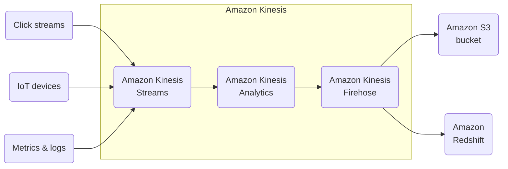
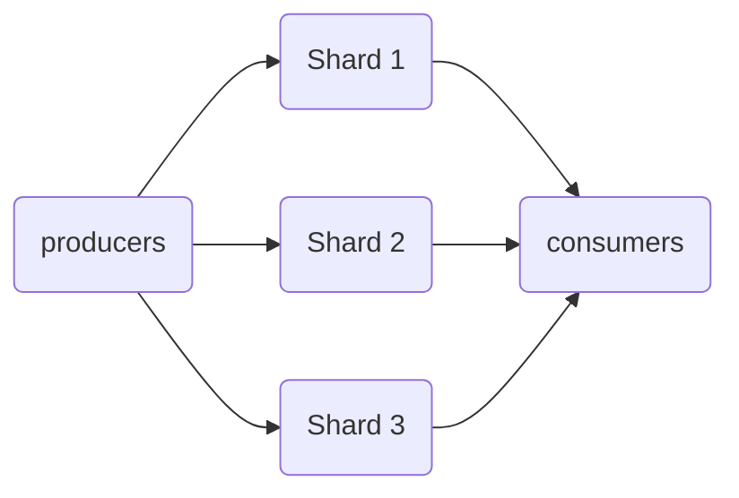
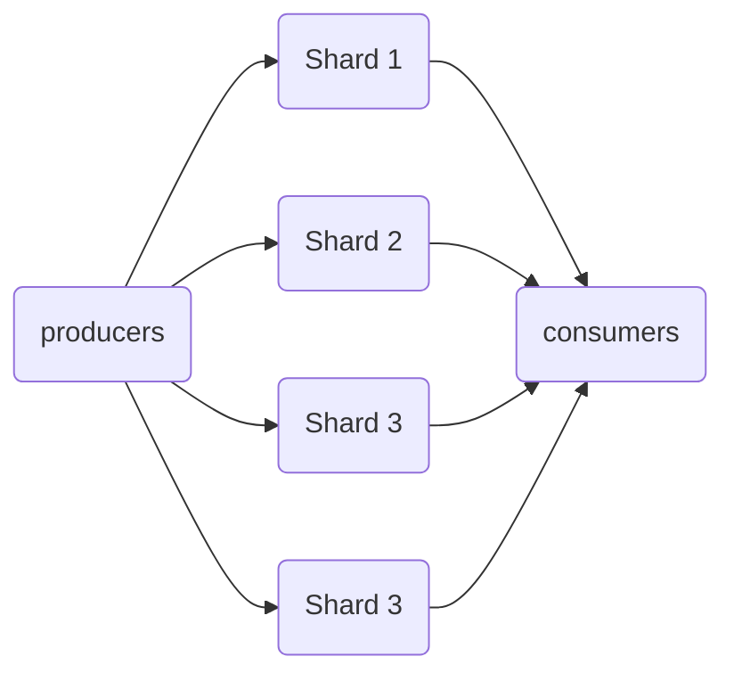
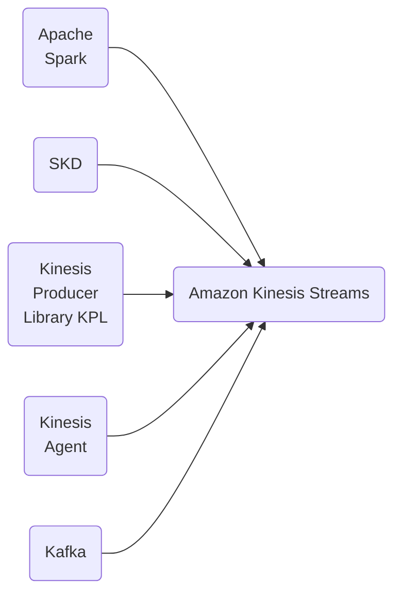
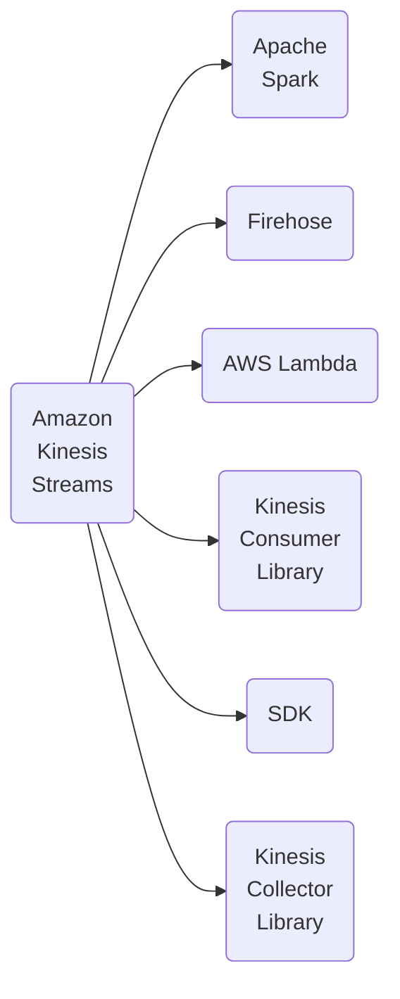
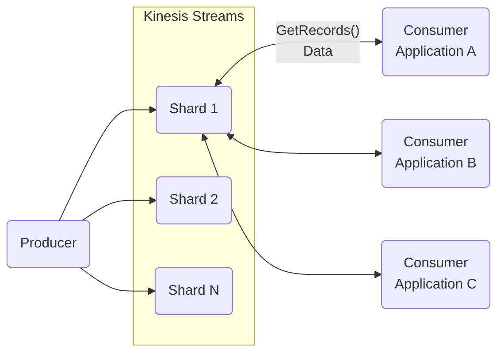
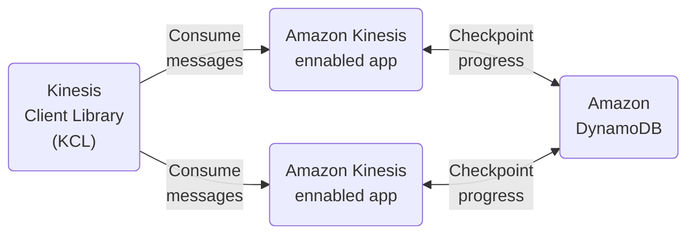
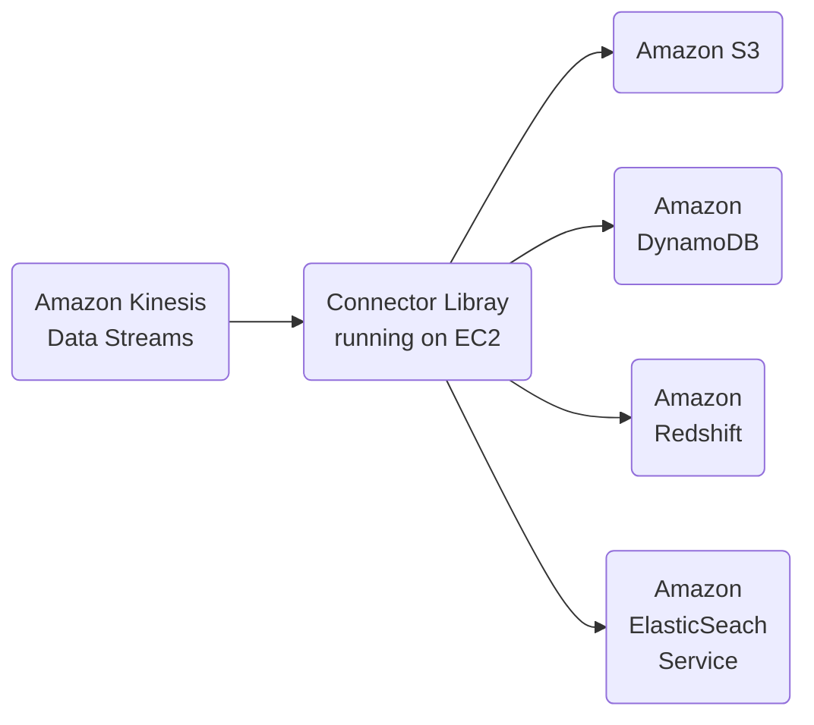

# Amazon Kinesis

[Back](readme.md)

## AWS Kinesis Overview

* Kinesis is a managed alternative to Apache Kafka.
* Great for applicaiton logs, metrics, Iot, clickstreams.
* Great for 'real-time' big data.
* Great for streaming processing frameworks (Spark, NiFi, etc)
* Data is automatically replicated synchronously to 3 AZ.
* Kinesis Streams: Low latency streaming ingest at scale
* Kinasys Analytics: Perform real-time analytics on streams using SQL.

### Kinesis

## Kinesis Streams Overview

* Streams are didvided into ordered Shard / Partitions

* Data retention is 24 hours by defaults. Can go up to 7 days.
* Ability ti reprocess / replay data.
* Multiple applications can consume the same stream.
* Real-Time processing with scale of throughput.
* Once data is inserted in Kinesis, it cannot be deleted (immutability).

## Kinesis Streams Shards

* One stream is mande of many different Shards
* Billing is per sharrd provisioned, can have as many shards as you want.
* Batching available or per message calls.
* The number ofshards can evolve over time (reshard/merge)
* Records are ordered per shard

## Kinesis Streams Records

    ┌────────────────────┐
    │   Data Blob        │
    │   (up to 1 MB)     │
    │                    │
    │   Bytes            │
    ┌────────────────────┐
    │   Record Key       │
    ┌────────────────────┐
    │   Sequence Number  │
    └────────────────────┘

* Data Blob
  * Data being sent.
  * Serialized as bytes.
  * Up to 1 MB.
  * Can represent anything.

* Record Key
  * Sent alongside a records
  * Helps to group records in Shards.
  * Same key = Same Shards.
  * Uses a highly distributed key to avoid the 'hot partition' problem.

* Sequence Number
  * Unique identifier for each records put in shard.
  * Added afer Kinesis integration.

## Kinesis Data Strema Limits to know

* Producer
  * 1 MB/s or 1000 messages/s at write PER SHARD.
  * "ProvisionedThroughputException" otherwise.
* Consumer Classic
  * 2 MB/s at read PER SHARD across all consumers.
  * 5 API calls per second PER SHARD across all consumers.
* Consumer Enhanced Fan-Out
  * 2 MB/s at read PER SHARD, PER ENHANCED consumers.
  * No API calls needed (push model).
* Data retention
  * 24 hours data retention by defaults.
  * Can be extended to 7 days.

## Kinesis Producers

* Kinesis SDK
* Kinesis Producer Library (KPL)
* Kinesis Agent
* 3rd party libraries
  * Spark, Log4J
  * Appenders, Flume, Kafka Connect, NiFi...

## Kinesys Producer SDK - PutRecords(s)

* APIs that are used are Putrecords (one) and PutRecords (many)
* PutRecors uses batching and increases throughout => less HTTP Requests
* ProvisionedThroughoutExceeded if we go over the limits.
* AWS Mobile SDK: Andrid, IOS, etc...
* Use Case: low throughput, higher latency, simple API, AWS Lambda
* Managed AWS sources for Kinesis Data Streams
  * CloudWatch Logs
  * AWS IoT
  * Kinesis Data Analytics
  
## AWS Kinesis API - Exceptions

* ProvisionedThroughputExceeded Exceptions
  * Happens when sending more data (exceeding MB/s or TPS for any shard)
  * Make sure you don't have a hot shard (such as your partition key is bad and yoo much data goes to that partition)

* Solution
  * Retries with backoff
  * Increase shards (scaling)
  * Ensure your partition key is a good one

## Kinesis Produer Library (KPL)

* Easy to use and highli configurable C++/Java library
* Used for building high performance, long running producres
* Automated and configurable retry mechanism
* Synchronous or Asynchronous API (better performance for async)
* Submits metrics to CloudWatch for monitoring
* Batching (both urned on by default) - increase throughout, decrease cost
  * Collect - Records and Write multiple shards in the same PutRecords API call
  * Aggregate - incresed latency
    * Capability to store multiple records in one record (go over 1000 records per second limit)
    * Increase payload size and improve throughut (maximize 1 MB/s limit)
* Compression must be implemented by the user
* KPL Records must be de-coded with KCL or special helper library

## Kinesis Producer Library (KPL) Batching

    ┌─────────────────────────────────────┐
    │ 2 KB |   40 KB   |      500 KB      │
    └─────────────────────────────────────┘
    ┌─────────────────────────────────────┐
    │ 1 KB | 30 KB |  80 KB  |   200 KB   │
    └─────────────────────────────────────┘

* Collection - PutRecords
* Aggregate into one record smaller < 1 MB
* We can influence the batching efficiency by introducing some delay with RecordMaxBufferedTime (default 100 ms).

## Kinesis Agent

* Monitor log files and sends them to Kinesis Data Streams
* Java-based agent, built on top of KPL
* Install in linux-based server environment.

### Features

* Write from multiple directories and write to multiple Streams.
* Routing feature ased on directory / log file.
* Pre-process data before sending to streams (single line, cv to json, log to json...)
* The agent handles file rotation, checkpointing, and retry upon failures.
* Emit metrics to CloudWatch for monitoring.

## Kinesis Consumers - Classic

* Kinesis SDK
* Kinesis Client Library (KCL)
* Kinesis Connector Library
* 3rd party libraries
  * Spark
  * Log4J Appenders
  * Flume
  * Kafka Connect
  * etc
* Kinesis Firehose
* AWS Lambda
* (Kinesis Consumer Enhanced Fan-out discussed in the next lecture)
  
## Kinesis Consumer SDK - GetRecords

* Classic Kinesis - Records are polled by consumers from a shard
* Each shard has 2 MB total aggregate throughput
* GetRecords returns up to 10 MB of data (then throttle for 5 seconds) or up to 10000 records
* Maximum of 5 GetRecords API calls per shard per second = 200 ms latency
* If 5 consumers applicaiton consume fromthe same shard, means every consumer can poll once a second and receive less than 400 KB/s.
  
## Kinesis Client Library (KCL)

* Java-first library but exists for other languages (Golang, Python, Ruby, Node, .NET...)
* Read records from Kinesis produced with the KPL (de-aggregation)
* Share multiple shards with multiple consumers in one "group", shard discovery
* Checkpointing feature to resume progress
* Leverages DynamoDB for coordination and checkpointing (one row per shard)
  * Make sure to provision enough WCU / RCU
  * Or use On-Demmand for DynamoDB
  * Otherwise DynamoDB may slow down KCL
* Record processos will process the data.

## Kinesis Connector Library

* Older Java Library (2016)
* Levrages the KCL Library
* Writes data to:
  * Amazon S3
  * DynamoDb
  * Redshift
  * ElasticSearch
* Kinesis Firehose replaces the Connector Library for a few of these targets. Lambda for the others.

## AWS Lambda sourcing from Kinesis

* AWS Lambda can source records from Kinesis Streams.
* Lambda consumer has a library to de-aggregate record from the KPL
* Lambda can be used to run lightweight ETL to
  * Amazon S3
  * DynamoDb
  * Redshoft
  * ElasticSearch
  * Anywhere you want.
* Lambda can be used to trigger notifications / send emails in real time.
* Lambda has a configurable batch size (more in Lambda section).

## Kinesis Enhanced Fan Out

* New game-changing feature from Aug 2018
* Works with KCL 2.0 and AWS Lambda (Nov 2018)
* Each consumer gets2 MB/s of provisioned throughput per shard
* That means 20 consumers will get 40 MB/s per shard aggreagated
* No more 2 MB/s limit!
* Enhanced Fan Out: Kinesis pushes data to consumers over HTTP/2
* Reduce latency (~70 ms now)
* A little more expensive

## Enhanced Fan-Out vs Standard Consumners

* Standard Consumers:
  * Low number of consuming applications (1,2,3...)
  * Can tolerate ~200 ms latency
  * Minimize cost

* Enhanced Fan Out Consumners:
  * Multiple Consumer applicaitons for the same stream
  * Low latency requirements ~70 ms
  * Higher costs (See Kinesis pricing page)
  * Default limit of 5 consumers using enhanced fan-out per data stream

## Bookmark - end of video2_5.mp4

