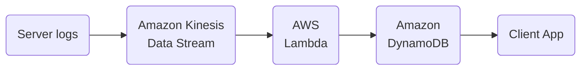
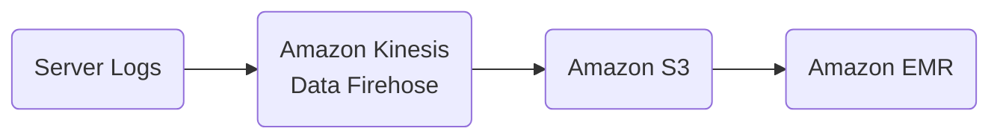
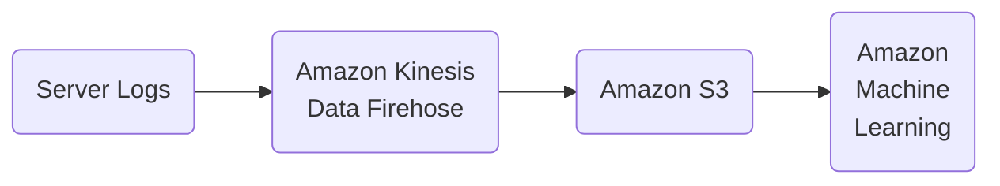
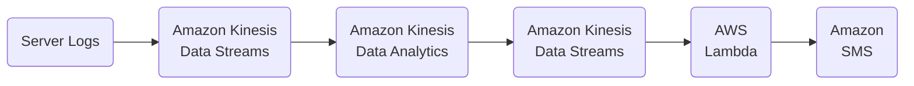
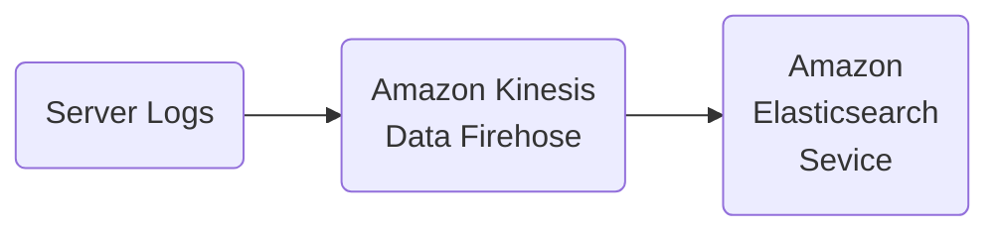
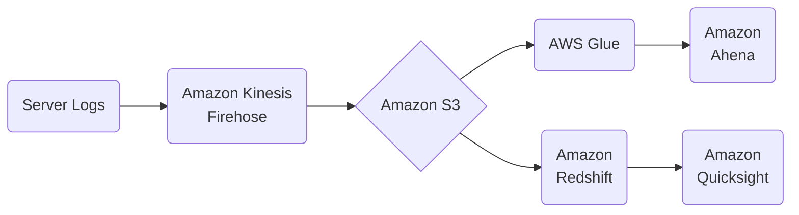
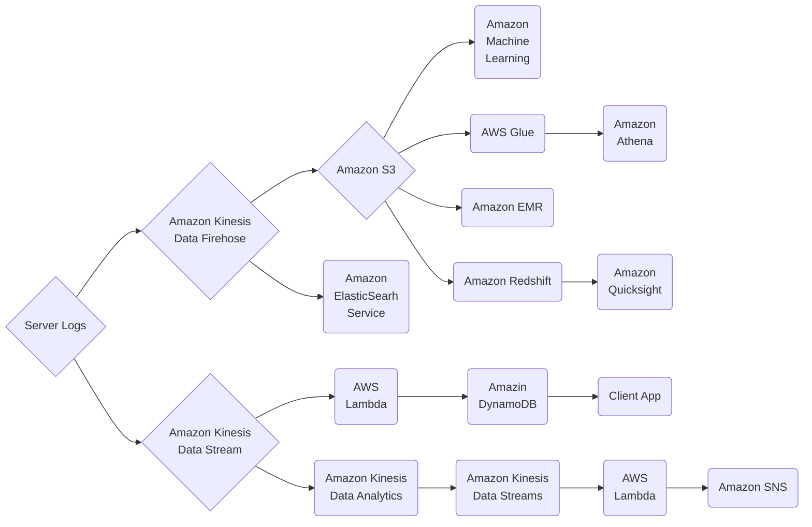

# Demo App for Class

Case study, about

## Requirements

### Order History App

### Product Recomendations

### Predicting Order Quantities

### Transaction Rate Alarm

### Near Real Time Log Analysis

### Data Warehousing & Visualization

### Putting It All Together

