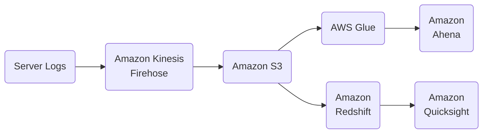
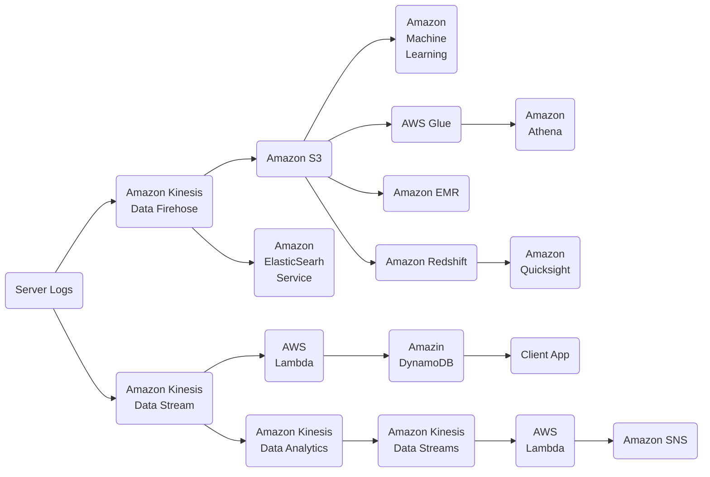

# Demo App for Class

Case study, about

## Requirements

### Requirement 1 - Order History App

### Requirement 2 - Product Recomendations

### Requirement 3 - Predicting Order Quantities

### Requirement 4 - Transaction Rate Alarm

### Requirement 5 - Near Real Time Log Analysis

### Requirement 6 - Data Warehousing & Visualization

### Putting It All Together

